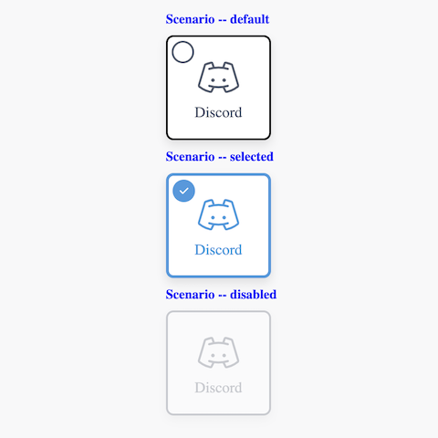

# Checkable Card



## Install 

In the root of the project

```
npm run usage --package blocks/checkable-card
```


## Credits 

Derived from this Pen: [https://codepen.io/havardob/pen/BapJYMg](https://codepen.io/havardob/pen/BapJYMg).

A demonstration of how to create checkboxes that doesn't necessarily looks like... well, checkboxes. 

Icons by https://phosphoricons.com/ 
